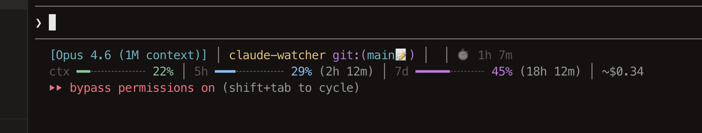

# claude-pulse

[한국어](docs/README.ko.md)

Blazing-fast Rust statusline HUD for Claude Code.

Real-time monitoring of context usage, token cost, output speed, tool activity, and rate limits — all in your statusline.



## Why

- **5x faster** than Node.js alternatives (~35ms vs ~180ms)
- **15x less memory** (3.6MB vs 56MB)
- **Zero runtime dependency** — single binary, no Node.js needed
- **50+ placeholders** with full template engine
- **Unique features**: `{speed}`, `{cost}`, `{sparkline}`, `{predict}`, `{todo_bar}`, conditional rules

## Install

In Claude Code:

```bash
# Add marketplace
/plugin marketplace add devy1540/claude-pulse

# Install plugin
/plugin install cp@claude-pulse

# Set up statusline binary
/cp:setup
```

## Commands

| Command | Description |
|---------|-------------|
| `/cp:setup` | Download binary + configure statusline |
| `/cp:configure` | Customize layout, bar, icons, colors, rules |
| `/cp:reset` | Reset config to defaults |
| `/cp:uninstall` | Remove binary, config, and statusline |

## Presets

| Preset | Description |
|--------|-------------|
| **Minimal** | Model + context bar only |
| **Standard** | Model + context + usage (default) |
| **Overview** | 2-line compact with speed/cost/7d + emoji icons |
| **Full** | All elements enabled |
| **Developer** | Tools/agents/todos + git stats |
| **Dashboard** | All metrics including memory + environment |

## Placeholders

### Identity
| Placeholder | Output |
|-------------|--------|
| `{model}` | `[Opus 4.6 (1M context)]` |
| `{project}` | Project path |
| `{git}` | `git:(main*)` |
| `{version}` | `CC v2.1.6` |
| `{session_name}` | Session name/slug |

### Context
| Placeholder | Output |
|-------------|--------|
| `{context}` | `ctx ━━━╌╌╌╌ 25%` |
| `{context_bar}` | `━━━╌╌╌╌` |
| `{context_pct}` | `25%` |
| `{token_breakdown}` | `in: 50k, cache: 171k` |
| `{sparkline}` | `▁▂▃▄▅▆▇` |

### Usage
| Placeholder | Output |
|-------------|--------|
| `{usage}` | `5h ━━╌╌ 26% (2h 34m)` |
| `{seven_day}` | `7d ━━━╌╌ 45% (2d 11h)` |
| `{usage_bar}` / `{usage_pct}` | Bar or percentage only |

### Activity
| Placeholder | Output |
|-------------|--------|
| `{tools}` | `✅ Read ×3 \| ✅ Edit ×2` |
| `{agents}` | Agent type, model, elapsed time |
| `{todos}` | `▶️ Task name (2/5)` |
| `{todo_bar}` | `[━━━╌╌╌] 3/5` |

### System & Meta
| Placeholder | Output |
|-------------|--------|
| `{speed}` | `~142 tok/s` — output token speed |
| `{cost}` | `~$0.29` — session cost estimate |
| `{predict}` | `~15 msgs left` — autocompact prediction |
| `{memory}` | `mem ━━━╌ 12.3GB / 16GB (77%)` |
| `{env}` | `1 CLAUDE.md \| 3 rules \| 2 MCPs` |
| `{duration}` | `⏱️ 46m` |
| `{extra}` | Custom shell command label (`--extra-cmd`) |

## Configuration

Config file: `~/.claude/plugins/claude-pulse/config.json`

### Template Lines

```json
{
  "lines": [
    "{model} │ {project} {git} │ {speed} │ {duration}",
    "{context} │ {usage} │ {seven_day} │ {cost}"
  ]
}
```

### Custom Labels

```json
{
  "labels": {
    "context": "Context",
    "usage": "Usage",
    "sevenDay": "Weekly",
    "memory": "RAM"
  }
}
```

### Bar Style

```json
{
  "bar": { "filled": "━", "empty": "╌", "width": 10 }
}
```

### Conditional Rules

Show/hide placeholders based on thresholds:

```json
{
  "rules": [
    { "show": "token_breakdown", "when": "context_pct >= 85" },
    { "show": "seven_day", "when": "seven_day_pct >= 70" }
  ]
}
```

### Colors

Named (`green`, `cyan`, `red`), ANSI 256 (`178`), or hex (`#5DADE2`):

```json
{
  "colors": {
    "context": "green",
    "usage": "brightBlue",
    "sevenDay": "magenta",
    "model": "#2E86C1"
  }
}
```

### Extra Command

Inject custom labels from any shell command:

```bash
# In statusLine config:
claude-pulse --extra-cmd "my-script.sh"
```

The script should output `{ "label": "your text" }`.

## Platforms

| Platform | Binary |
|----------|--------|
| macOS ARM (Apple Silicon) | `claude-pulse-aarch64-apple-darwin` |
| macOS Intel | `claude-pulse-x86_64-apple-darwin` |
| Linux x86-64 | `claude-pulse-x86_64-unknown-linux-gnu` |
| Linux ARM64 | `claude-pulse-aarch64-unknown-linux-gnu` |
| Windows | `claude-pulse-x86_64-pc-windows-msvc.exe` |

## License

MIT
